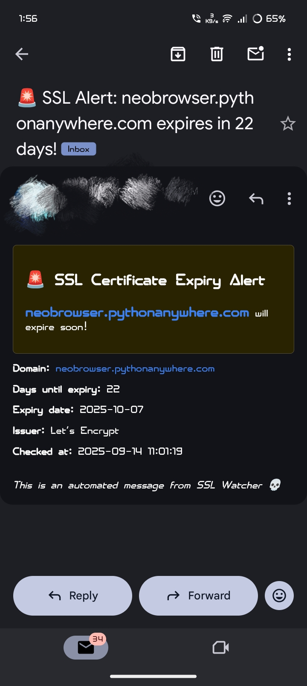

🚨 SSL WATCHER PRO - THE SSL EXORCIST 💀🔥

> ⚠️ WARNING: This tool might make your ISP file a restraining order. Use responsibly (or don't — I'm not your mom).

---

🗿 WHAT IN THE ACTUAL FUCK IS THIS?

SSL Watcher Pro is what happens when you give a sleep-deprived developer too much caffeine and access to the ssl module.
This Python script:

👀 Stalks SSL certificates like they're your ex on Instagram

📧 Spams your inbox with panic-inducing emails

📊 Generates PDF reports that nobody will ever read

🔥 Burns through your Gmail quota like it's 1999

---

🖥️ INSTALLATION (IF YOU DARE)

# Step 1: Clone this repository (like anyone will actually contribute)
git clone https://github.com/dwip-the-dev/SSL-Watcher.git
cd SSL-Watcher

# Step 2: Create a virtual environment (because we're fancy like that)
python3 -m venv venv
source venv/bin/activate

# Step 3: Install dependencies (pray to the Python gods)
pip install flask reportlab

# Step 4: Sacrifice a router to the networking gods
# (Seriously, don't actually run destructive commands.)

---

⚙️ CONFIGURATION (THE "FUCK IT" SETUP)

1. Edit the code like a degenerate (find the SMTP config part).

2. Put in your Gmail and app password (RIP your account security).

3. Create emails.json with all the people you want to annoy:

{
  "emails": [
    "your-boss@company.com",
    "your-ex@regret.com",
    "random-stranger@why-not.com"
  ]
}

---

🚀 USAGE (HOW TO PISS PEOPLE OFF)

# Run this bad boy
python3 main.py

# Then open http://localhost:5000 and prepare for:
# - Regret
# - Confusion
# - "Why did I build this again?"

---

🎯 FEATURES NOBODY ASKED FOR

✅ SSL Stalking — Watches certificates like a creepy neighbor

✅ Email Terrorism — Spams everyone you've ever met

✅ PDF Generation — Creates reports that will never be opened

✅ Web UI — So you can feel like a 1337 h4x0r

✅ Background Checks — Runs while you sleep (creepy)

✅ Multi-recipient Annoyance — Why bother one person when you can bother everyone?

---

📧 EMAILS YOU'LL SEND (AND REGRET)

Example subject/body:

🚨 SSL Alert: example.com expires in 15 days!

Translation: "Please unsubscribe me from your life choices"

> NOTE: The test email is only for testing and not the real alert. Monitor responsibly — only domains you own.

---

📑 PDF REPORTS

The tool can create PDF reports summarizing certificate details and expiry info. (Most of these PDFs will be ignored, like 99% of status emails.)

[pdf](pdf.jpg)

---

🛑 LEGAL DISCLAIMER (LOL)

I am not responsible for:

Your ISP disconnecting you

Your friends blocking you

Your boss firing you

Your cat judging you

The existential crisis that follows using this tool

Use at your own risk (and preferably on a VPN). Monitor only domains you own.

---

🤡 WHY DOES THIS EXIST?

1. ❌ Deleted my old GitHub account

2. 💀 Need commit streaks to feel validated

3. ☕ Had too much caffeine

4. 😭 Hate seeing successful people

---

🎪 ROADMAP (DELUSIONAL EDITION)

Discord Webhooks — Annoy gamers too

SMS Notifications — Because emails aren't enough

Telegram Bot — Stalk certificates on-the-go

Blockchain Integration — Make it needlessly complicated

NFT Certificates — Because why the fuck not

AI Panic Mode — Sends increasingly dramatic alerts

---

👥 CONTRIBUTING (PLEASE DON'T)

If you actually want to contribute:

1. Fork this mess

2. Add more useless features

3. Submit a PR

4. Question your life choices

---

📜 LICENSE

"Do Whatever the Fuck You Want" License (DWTFYW)

Use it

Break it

Blame me

I don't care

---

🪦 CREDITS

Me — For this abomination

Python — For enabling my bad decisions

Flask — For the web interface nobody asked for

Gmail — For not blocking me yet

Caffeine — The real MVP

---

🔥 FINAL WARNING

# Before running, ask yourself:
# "Am I ready to explain this to my ISP?"
# "Do I have enough friends to lose?"
# "Is my therapist on speed dial?"

# If you answered yes to all, proceed:
python3 main.py

SSL Watcher Pro: Because sometimes you need to automate poor life decisions. 💀
