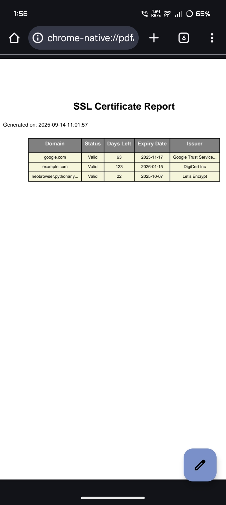

## 🚨 SSL WATCHER PRO - THE SSL EXORCIST 💀🔥

## ⚠️ WARNING: This tool might make your ISP file a restraining order. Use responsibly (or don't, I'm not your mom).

---

## 🗿 WHAT IN THE ACTUAL FUCK IS THIS?

SSL Watcher Pro is what happens when you give a sleep-deprived developer too much caffeine and access to the SSL module. It's a Python script that:

· 👀 Stalks SSL certificates like they're your ex on Instagram

· 📧 Spams your inbox with panic-inducing emails

· 📊 Generates PDF reports that nobody will ever read

· 🔥 Burns through your Gmail quota like it's 1999

---

## 🖥️ INSTALLATION (IF YOU DARE)

```bash
# Step 1: Clone this repository (like anyone will actually contribute)
git clone https://github.com/dwip-the-dev/SSL-Watcher.git
cd SSL-Watcher

# Step 2: Create a virtual environment (because we're fancy like that)
python3 -m venv venv
source venv/bin/activate

# Step 3: Install dependencies (pray to the Python gods)
pip install flask reportlab

# Step 4: Sacrifice a router to the networking gods
sudo rm -rf /your/sense/of/sanity
```

---

## ⚙️ CONFIGURATION (THE "FUCK IT" SETUP)

1. Edit the code like a degenerate (find the SMTP config part)
2. Put in your Gmail and app password (RIP your account security)
3. Create emails.json with all the people you want to annoy:

```json
{
  "emails": [
    "your-boss@company.com",
    "your-ex@regret.com", 
    "random-stranger@why-not.com"
  ]
}
```

---

## 🚀 USAGE (HOW TO PISS PEOPLE OFF)

```bash
# Run this bad boy
python3 main.py

# Then open http://localhost:5000 and prepare for:
# - Regret
# - Confusion  
# - Why did I build this again?
```

---

## 🎯 FEATURES NOBODY ASKED FOR

· ✅ SSL Stalking - Watches certificates like a creepy neighbor

· ✅ Email Terrorism - Spams everyone you've ever met

· ✅ PDF Generation - Creates reports that will never be opened

· ✅ Web UI - So you can feel like a 1337 h4x0r

· ✅ Background Checks - Runs while you sleep (creepy)

· ✅ Multi-recipient Annoyance - Why bother one person when you can bother everyone?

---

## 📧 EMAILS YOU'LL SEND (AND REGRET)

```
🚨 SSL Alert: example.com expires in 15 days!

Translation: "Please unsubscribe me from your life choices"
```

AND WHEN AN SSL IS EXPIRING IT WILL AUTOMATICALLY SEND THE ALERT - THE TEST EMAIL IS ONLY FOR TESTING AND NOT THE REAL ALERT. SO JUST WAIT AND WATCH 😐😐😐😐


---

## 📑 PDF YOU WILL GET



---

## 🛑 LEGAL DISCLAIMER (LOL)

I am not responsible for:
· Your ISP disconnecting you

· Your friends blocking you

· Your boss firing you

· Your cat judging you

· The existential crisis that follows using this tool

Use at your own risk (and preferably on a VPN).

---

## 🤡 WHY DOES THIS EXIST?

Because I:

1. ❌ Deleted my old GitHub account
2. 💀 Need commit streaks to feel validated
3. ☕ Had too much caffeine
4. 😭 Hate seeing successful people
   

---

## 🎪 ROADMAP (DELUSIONAL EDITION)

· Discord Webhooks - Annoy gamers too

· SMS Notifications - Because emails aren't enough

· Telegram Bot - Stalk certificates on-the-go

· Blockchain Integration - Make it needlessly complicated

· NFT Certificates - Because why the fuck not

· AI Panic Mode - Sends increasingly dramatic alerts

---

## 👥 CONTRIBUTING (PLEASE DON'T)

If you actually want to contribute:

1. Fork this mess
2. Add more useless features
3. Submit a PR
4. Question your life choices

---

## 📜 LICENSE

"Do Whatever the Fuck You Want" License (DWTFYW)
· Use it
· Break it
· Blame me
· I don't care

---

## 🪦 CREDITS

· Me - For this abomination
· Python - For enabling my bad decisions
· Flask - For the web interface nobody asked for
· Gmail - For not blocking me yet
· Caffeine - The real MVP

---

## 🔥 FINAL WARNING

```bash
# Before running, ask yourself:
# "Am I ready to explain this to my ISP?"
# "Do I have enough friends to lose?" 
# "Is my therapist on speed dial?"

# If you answered yes to all, proceed:
python3 main.py
```

---

SSL Watcher Pro: Because sometimes you need to automate poor life decisions. 💀

---

⚠️ Seriously though: Monitor only domains you own. Your ISP can and will fuck up your day if you abuse this.

Built with hate and caffeine by dwip-the-dev 💀☕
